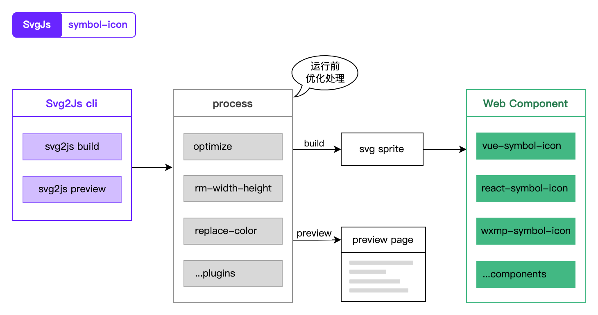

## svg in JS 之图标的解决方案

> [svgjs](https://github.com/svg-in-js/svgjs): 将网页上所有的图形元素用 svg 来实现

### 背景

svg 是一种使用 XML 定义的可缩放矢量图形，在不同分辨率或者改变其尺寸时，图形质量不会受到影响；在当前高清屏比较普遍的形势下，前端开发需要确保网页上的图形在不同分辨率、不同 dpr 的设备上表现一致，此时不得不说使用 svg 图形绝对是一个非常不错的选择；一方面，常规的做法需要准备几套图片，通过判断设备的分辨率和 dpr 来做切换，实现起来比较复杂，另一方面，基于 svg 天生携带的可缩放 buff，只需一个图形即可确保显示上的一致性；

说起前端的图标解决方案，那应该是非常多了，几乎各个组件库都有自己的一个图标组件，开源社区上也有不少实现方式，其中有基于 svg 的、有基于字体的、也有直接对开源图标做一层包装的，那么，为什么还要再实现一套 `svg in JS` 的图标解决方案呢？咱们先看一看当前图标方案的现状：

1. 组件库自带的图标组件

对于一个组件库而言，图标组件必不可少，既需要满足组件库内部场景，同时也能内置一批常见图标供用户使用，而对于项目中需要大量图标，组件库并没有提供的，则需要配置构建工具的插件，比如将 svg 文件转成 vue 组件来使用，需要进行大量的图标组件注册，相当于实现了一种 `inline svg` 的模式；

2. 字体图标

这种方式有个比较大的好处就是，对图标的颜色控制非常方便，就使用常规的 `css color` 即可，但是字体图标只能支持单色图标，对于颜色比较丰富的图标则需要再寻一种方案；

3. 包装社区上开源的图标

这种方式对于开源项目比较友好，拿来即用，但是对于企业项目开发并不推荐，企业项目开发涉及到的图标个性化比较强，开源图标中大概率并未提供，存在大量冗余未使用到的图标；

4. svgSprite

比如通过配置 `svg-sprite-loader` 来将项目中的 svg 转成一个 `svgSprite`，实现了图标的复用，但是对于图标的引用和颜色控制却还比较原始；

当然，对于图标组件遍地开花的前端现状，还有很多实现方式就不列举了，但是有个比较明显的特点值得关注：除了字体图标，其他图标实现方式无外乎两种：`inline svg` 和 `svgSprite`；

先来了解一下什么是 `inline svg`，即将 svg 源码写入 html 的方式，其有两个比较大的好处：一个是避免了 svg 作为独立文件加载时的一次网络请求，另一个是方便对 svg 内部节点进行一些操作，比如颜色设置；但凡事都有两面性，其缺点就是难以复用，对于需要重复使用的图标，其会导致重复渲染多次，内部节点控制时涉及到一些计算逻辑，也难免会降低运行时的效率；而 `svgSprite`，不用多说，他就是为了解决 svg 可复用的，但也仅仅如此；

以上，不难看出图标方案还处于百家争鸣的局面：`inline svg` 模式比较常见，虽实现 `svgSprite` 也很简单，但对其应用模式还比较原始，颜色控制也稍显复杂，同时也都需要构建工具做额外的支持；

### svg in JS 的图标解决方案




如图，该方案包括两个部分：一个是 `svg2js`，一个是封装好的组件；

在构建工具加持下的现代前端开发，要使用 svg 首先需要配置相应的构建插件，如 webpack 里的 `file-loader`，其他构建工具也需要对应的插件配置，再比如到了 vite 里，需要配置 `vite-plugin-svg-icons`；有时候我就在想，为什么使用一个图标还需要构建工具的配置，不同构建工具还不一样，甚至用法都不一样，有没有可能简化一些呢，比如：统一的构建方式？统一的用法？

### svg2js: 统一的 svg 构建方式

* 是什么？

    一个用来处理项目中 svg 图标的命令行脚本

* 做什么？

    优化和管理项目中的 svg 图标：
    
    - 通过命令的方式优化 svg 图标并生成一个 `svgSprite`
    - 随时预览项目中的 svg 图标，统一管理

* 好处？

    - 无构建工具的相关配置
    - 可以在需要时执行一个命令，即可将项目中的 svg 图标进行优化处理，一般可大大降低文件体积
    - 随时预览和管理项目中所有的图标
    - 通过脚本的方式，提前优化图标、提取关键信息、颜色处理等，避免 `inline svg` 模式下在运行时做这些处理，可提高运行效率

在这里，通过一个通用脚本的方式，脱离了各种构建工具的关联，实现了对项目中 svg 文件的统一处理方式；

### svg2js 的用法

全局安装即可使用 `svg2js` 命令，也可以直接使用 `npx @svgjs/cli` 临时使用，不过更推荐安装在项目里，在 `scripts` 里配置一个相对固定的命令，在日常开发中可随时使用；目前，`svg2js` 主要提供两个命令：1. 处理 svg 文件生成 `svgSprite`；2. 同样是处理 svg，但是会生成一个可预览的页面；

* 安装

```js
pnpm add -D @svgjs/cli
// or
npm i -D @svgjs/cli 
```

* svg2js build

在 `package.json` 的 `scripts` 里添加一个命令，如:

```js
{
  "build:svg": "svg2js build -e src/assets -o src/js"
}
```

将 `src/assets` 目录下的 svg 图标进行优化处理后生成一个 `svg-sprite.js` 文件到 `src/js` 目录下，后续需求迭代如果对图标有进行增删改的操作，同样执行这个命令即可

* svg2js preview

在 `package.json` 的 `scripts` 里添加一个命令，如:

```js
{
  "preview:svg": "svg2js preview -e src/assets -o src/js"
}
```

将 `src/assets` 目录下的 svg 图标进行优化处理后生成一个 html 页面，打开即可预览项目中的所有图标，项目中图标文件较多时比较方便找图标

* 预处理：运行时提效

1. 类似于 `vue template` 在 compile 时会进行一些代码的优化处理，提高 vue 代码的运行效率一样，咱们通过脚本的方式可对项目的 svg 图标全部进行优化处理，将大大缩小文件体积；

2. 相较于 `inline svg` 会对 svg 内容进行一些处理来达到一些效果，通过脚本的方式的好处是，可以在此时提取一些 svg 的关键信息，比如宽、高、viewBox等，作为元信息在运行时直接取值即可；

3. svg 图标的颜色处理一般都稍显复杂，默认颜色、激活时颜色、禁用时颜色等，平时我们在项目开发时可能就是定义一个 `class` 往里面找到 svg 的 `path` 节点来改颜色，现在有个便捷的方式就是，在脚本里就提取单色图标的颜色值存为元信息，并替换为 `currentColor`，那么改图标颜色就跟普通的 `css` 一样操作了，非常方便；当然，`inline svg` 也完全可以处理，但是假如你的项目中有大量的使用 svg 图标，其运行效率明显低于脚本处理；

### vue-symbol-icon: 统一的 svg 图标组件

此处以 `vue2.x` 版本为例，其他框架的支持还未实现，在这也欢迎有兴趣的小伙伴们参与进来，提供宝贵的意见；

经过上一步的脚本部署，不出意外的话，运行 `npm build:svg` 将会把您项目中的 svg 文件统一处理并生成一个 `svgSprite` 文件，而这个文件就是图标组件的主要消费对象;

* 安装

```js
pnpm add @svgjs/vue2-symbol-icon
// or 
npm i @svgjs/vue2-symbol-icon
```

* 初始化

优先推荐使用 vue 插件的方式对图标组件进行初始化

```js
import Vue from 'vue';
import symbolIconPlugin from '@svgjs/vue2-symbol-icon';

Vue.use(symbolIconPlugin);
```

在使用 vue 插件时也可以配置一些全局参数，支持的参数如下：

| 名称 | 类型 | 默认值 | 说明 |
| --- | --- | --- | --- |
| name | string | svg-symbol-icon | 图标组件的名称 |
| color | string | -- | 图标的默认颜色 |
| disabledColor | string | -- | 图标被禁用时的颜色 |
| hoverColor | string | -- | 鼠标经过图标时的颜色 |
| activedColor | string | -- | 鼠标按下图标时的颜色 |
| placeholderColor | string | -- | 图标作为占位图时的颜色 |

比如配置了 color，那么所有用到的图标默认颜色都是这个，如果有的图标需要不一样的颜色，可通过设置图标的 `props color`；即优先使用组件的 `props color`，如果没有设置则使用全局配置的 color，如果全局没配置 color 则使用默认的颜色；

* 也可以通过自定义组件的方式

```js
import VUe from 'vue';
import { SvgSymbolIcon, setGlobalOption } from '@svgjs/vue2-symbol-icon';

Vue.component('symbol-icon', SvgSymbolIcon);

// 全局设置，这时不支持设置 name
setGlobalOption({
  color,
  disabledColor,
  hoverColor,
  activedColor,
  placeholderColor,
});
```

* 基本用法

```html
<symbol-icon name="name" />
```

* 支持下列 props

| 名称 | 类型 | 默认值 | 说明 |
| --- | --- | --- | --- |
| name | string | -- | 图标的名称，也即 sprite 内的 symbol-id |
| disabled | boolean | fasle | 是否禁用 |
| size | number, string, array | -- | 设置图标的宽高 |
| sizeUnit | string | px | 图标宽高的单位 |
| spin | boolean | false | 是否使用旋转动画 |
| flipV | boolean | false | 是否纵向翻转 |
| flipH | boolean | false | 是否横向翻转 |
| color | string | -- | 设置该图标的颜色，会覆盖全局设置的 color |
| disabledColor | string | -- | 设置该图标禁用时的颜色，会覆盖全局设置的 disabledColor |
| hoverColor | string | -- | 设置鼠标经过时的颜色，会覆盖全局设置的 hoverColor |
| activedColor | string | -- | 设置鼠标按下时的颜色，会覆盖全局设置的 activedColor |
| tooltip | string, object | -- | 设置 tooltip |

在实际开发时，有个简便的办法就是运行 `npm preview:svg` 后打开一个预览的页面，在页面上可以快速找到需要的图标，点击直接复制代码即可使用；

在这个组件内部，默认引入了一个第三方的功能 `tippy`，但默认未做初始化，假如需要给图标添加 `tooltip` 功能，可直接配置 `tooltip` 属性，如果需要自定义 `tippy` 的主题，参考官方做法：[tippyjs themes](https://tippyjs.bootcss.com/themes/)，同时需要单独引入一个 css 文件：`import 'tippy.js/dist/tippy.css'`

* 事件

| 事件名 | 说明 |
| --- | --- |
| on-click | 点击事件 |

### 对比纯 inline-svg mode

准确说这个方案属于半个 `inline-svg` 和 `svg-sprite` 的结合，相较于纯 `inline-svg mode`，在组件代码里会对 svg 内容做一些处理来达到某种效果；比如控制 svg 的某个节点，通过多个正则匹配一些关键的节点信息等；单纯的 `inline-svg` 不具备可复用性，系统内存在一些场景会多次使用到同一个图标，那么将会导致这个图标内部逻辑处理多次，同时页面上也将同样渲染多次这个 svg；

基于一些相对复杂的场景和大量图标需要被使用的情况，`svg2js` 的做法是在代码进入运行时之前，提取 svg 文件的一些关键信息，比如宽、高、viewBox等，修改单色图标的占位颜色等可能需要的对 svg 内容的处理，将 `inline-svg mode` 下的内部处理逻辑通过脚本的方式前置处理，这样能够大大提高图标显示时的运行效率；

### 颜色控制方案

这里的颜色控制只限于单色图标，但是按照同一个思路，多色图标也完全可以支持，只是从实际开发中来看，几乎没有遇到需要控制图标的多个颜色的情况，有可能出现过这个情况，不过切换图标可能相对于改变多个颜色来说更方便，暂时不对多色图标做处理；

如何判断和识别单色图标呢？

(path, rect, circle, polygon, line, polyline, ellipse)，使用正则匹配以上这些元素上设置的 `fill` 和 `stroke` 属性， 如果匹配到的结果为同一个值，那么就认为这个 svg 为单色图标，当然此处还需要排除值为 `none` 和值为 `url` 格式的情况；

识别到单色图标后，将其颜色值重置为 `currentColor`，那么就可以通过简单的 `css color` 设置来控制图标的颜色了，接下来处理 `hover color`，`disabled color` 就只需要切换 `class` 即可，至此，svg 的颜色控制就跟普通的元素颜色控制没差别了；

### 更新

* 已将 `@svgjs/cli` 包内置于 `@svgjs/vue2-symbol-icon` 和 `@svgjs/vue-symbol-icon`，无需安装两个包，只需要安装组件包即可使用到 `svg2js` 命令

### 总结

以上，实现了一套新的 svg in JS 图标解决方案：脚本预处理 + web 组件 = 增强 + 提效；

通过脚本的方式脱离多种构建工具的关联，用统一的方式来处理 svg 文件；

通过 web 组件提供常规的交互功能，用统一的方式来使用 svg；

最后，如果有同学也对 svg 比较感兴趣，欢迎加入一起开发，或者分享您宝贵的意见，我们的愿景就是：将网页上所有的图形元素用 svg 来实现，仓库地址：[svgjs](https://github.com/svg-in-js/svgjs)
